# Load Balanced Web Application

## High-availability Flask application with Nginx load balancing, sticky sessions, and MySQL persistence.
---

## Sequence Diagram


### Structure



## The system consists of three main components:

1. `app`: Flask application with Python backend
2. `nginx`: Load balancer configuration
3. `db`: MySQL database setup

<br>

## The diagram demonstrates the system's request handling:

- **Load balancing** with session persistence
- **Database transaction flow**
- **Response handling mechanism**

---

## Quick Start

```bash
# Deploy application
docker-compose up -d

# Scale application
./scale.sh <number_of_replicas>
```

---

## Core Features

- **High Availability**: Load balanced architecture
- **Session Persistence**: Cookie-based sticky sessions (5-minute TTL)
- **Data Persistence**: Transactional database operations
- **Horizontal Scaling**: Dynamic container management

---

## API Specification

| Endpoint         | Method | Description                                 |
|------------------|--------|---------------------------------------------|
| `/`              | GET    | Retrieves server IP and establishes session |
| `/showcount`     | GET    | Retrieves global request counter            |

---

## System Configuration

### Network Configuration

| Service      | Port  | Protocol |
|--------------|-------|----------|
| Nginx        | 80    | HTTP     |
| Application  | 5000  | HTTP     |
| MySQL        | 3306  | TCP      |

### Environment Configuration

```properties
DB_HOST=mysql-db
DB_USER=root
DB_PASSWORD=rootpassword
DB_NAME=app_db
